

# AffProof

[English](README.md) · [中文](README.zh.md) · [Español](README.es.md) · Deutsch · [Français](README.fr.md)

🌐 **[affproof.com](https://affproof.com)** · [GitHub @frommmmmg](https://github.com/frommmmmg)

✍️ Von **姜芊泽 (Jiang Qianze)** · WeChat-Offizialkonto: **Pin海引航**

> **Dieses Repository ist ein Schaufenster, keine Quellcode-Veröffentlichung.** AffProof ist nicht quelloffen, deshalb gibt es hier keinen Code, nur was es kann, wie es gebaut ist und wie es aussieht. Wenn du darüber sprechen möchtest, melde dich über mein [GitHub-Profil](https://github.com/frommmmmg).

**Ein öffentliches, mehrsprachiges Verzeichnis, das Partnerprogramme prüft, damit man weiß, welche wirklich zahlen.** Jeder Eintrag enthält ein belegbasiertes Prüfprofil, einen Reputationswert, Auszahlungsnachweise und eine Streitfall-Historie.

Im Affiliate-Marketing gibt es viele Programme, die auf der Landingpage großzügig wirken und still aufhören zu zahlen, sobald man skaliert. Die meisten Verzeichnisse übernehmen einfach die Angaben des Anbieters. AffProof geht vom anderen Ende aus: Es erfasst, was sich prüfen lässt (die echte Programmseite, die tatsächlich angebotenen Auszahlungskanäle, die schriftlichen Provisionsbedingungen) und lässt die Community ergänzen, was nur sie wissen kann, etwa ob das Geld ankam. Das Motto lautet *Proof of payout. Zero fluff.*

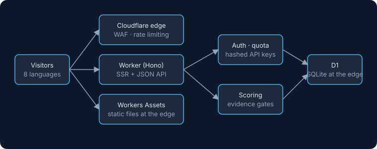

| | |
|---|---|
| **Website** | **[affproof.com](https://affproof.com)**, in 8 Sprachen |
| **Meine Rolle** | Von einer Person entworfen, gebaut und betrieben: Produkt, Datenpipeline, Frontend, Edge-Backend, Betrieb |
| **Status** | Live im Produktivbetrieb |
| **Umfang** | 380 Programme erfasst, 377 mit vollständigem geprüftem Profil (Oktober 2026) |
| **Technik** | Cloudflare Workers · Hono · D1 · Workers Assets · GitHub Actions |

### Was es kann

**Für Webmaster**
- **Schnell das passende Programm finden.** Live-Suche mit Filtern für Plattform, Auszahlungskanal und Zeitraum, vier Sortierungen (empfohlen, Klicks, Rang-Anstieg, Nachweise) und ein Gold-Audit-Filter.
- **Ein strenges Kanalraster statt Werbeversprechen.** Jede Karte zeigt dieselben festen Felder für USDT, PayPal, Payoneer, Stripe und Kontaktkanäle, hell wenn vorhanden und durchgestrichen wenn nicht, damit alles bündig bleibt und nichts beschönigt werden kann.
- **Lesbare Reputation.** Ein Wert von 1000, zusammengesetzt aus dem Prüfprofil, einem gleitenden 30-Tage-Fenster aus Auszahlungsnachweisen und Bewertungen, Aktivität mit Abklingen sowie Abzügen für Streitfälle, die ein Anbieter nicht binnen 48 Stunden beantwortet hat. Ein Anbieter, der seine Streitfälle löst, erholt sich automatisch.
- **Zwei vollständige Oberflächen-Themes, live umschaltbar:** ein dichtes Schwarz-Gold-Layout und ein 8-Bit-Pixel-Arcade-Skin mit optionalem Sound. Ein Breitenschalter (1200, 768 und 390 px) zeigt Tablet- und Handy-Größen.

**Für Anbieter**
- **Einen Eintrag in etwa zehn Sekunden beanspruchen** und ein dynamisches *Verified by AffProof*-SVG-Badge auf der eigenen Seite einbetten.

**Für Suche und Entwickler**
- **Serverseitiges Rendering für die Suche.** Seiten werden im Worker gerendert, mit JSON-LD-Strukturdaten, `hreflang`-Tags und einer Sitemap pro Sprache.
- **8 Sprachen**, mit einem Übersetzungsablauf, der alle Sprachen mit dem englischen Original abgleicht.
- **Eine öffentliche API mit Tarifen.** Schlüssel werden als SHA-256-Hashes gespeichert und in einer Middleware geprüft. Free, Pro und Enterprise steuern Paginierungslimits und zurückgegebene Felder.

## Screenshots

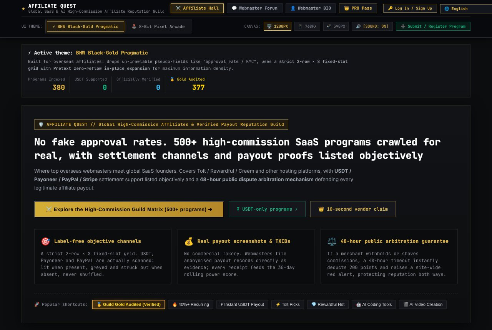
*Die Startseite im Standard-Theme Schwarz-Gold.*

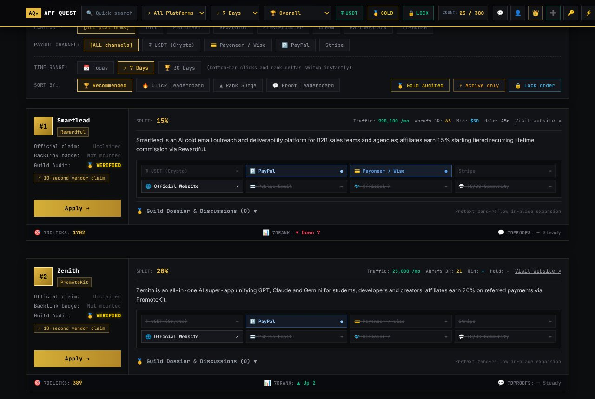
*Das Programmverzeichnis: Filter, Sortierungen und das feste Kanalraster.*

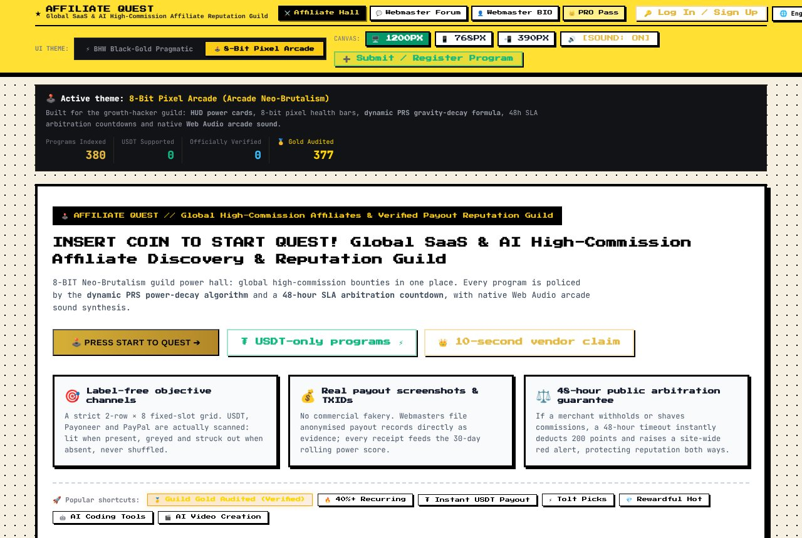

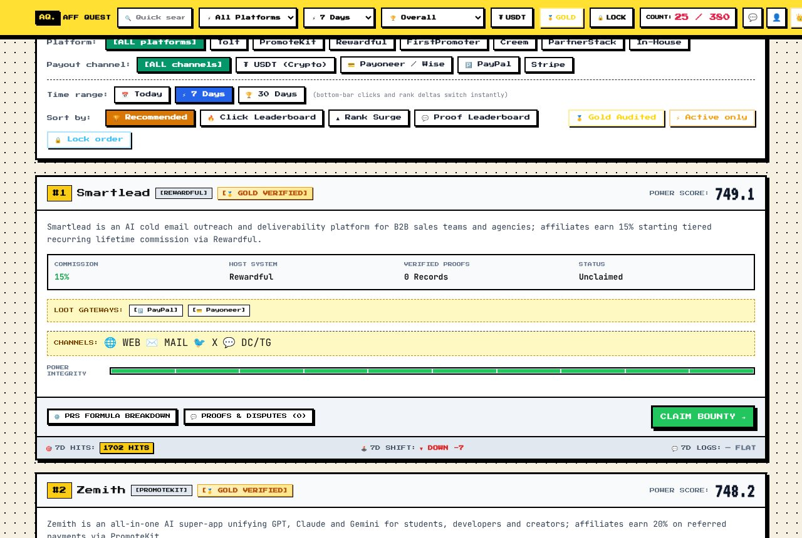
*Dieselben Seiten im 8-Bit-Arcade-Theme.*

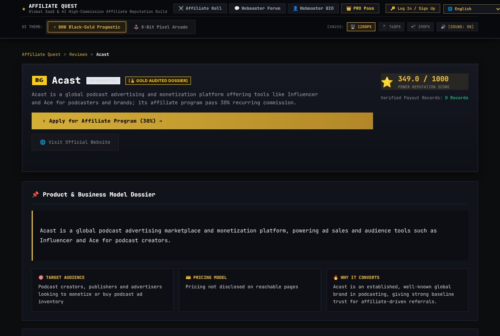

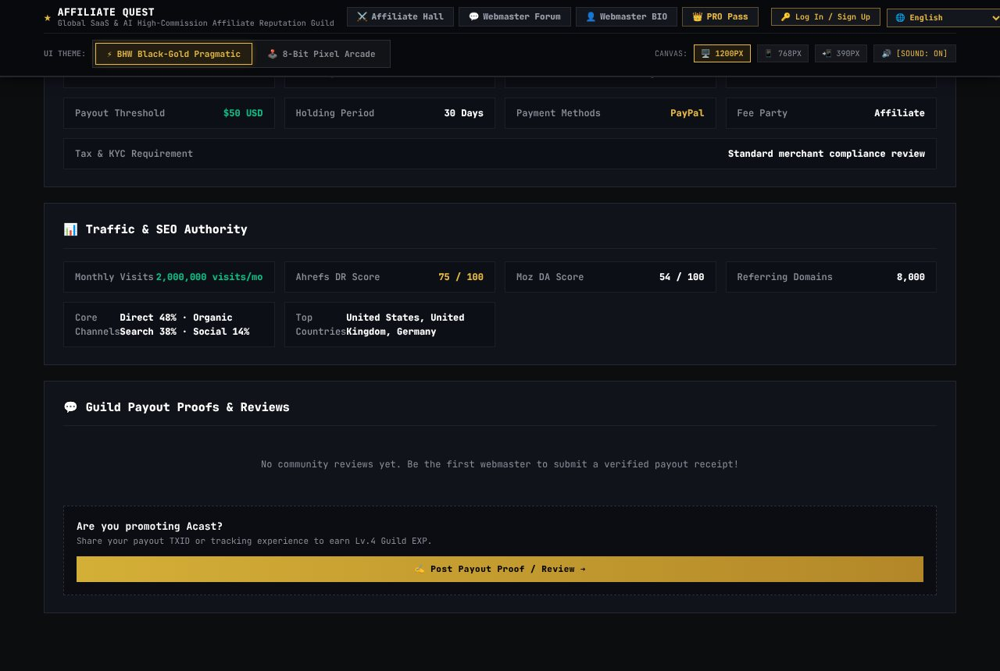
*Eine Prüfprofil-Seite samt Abschnitt zu Geschäftsbedingungen und Traffic.*

*Die Startseite auf Chinesisch und Deutsch.*

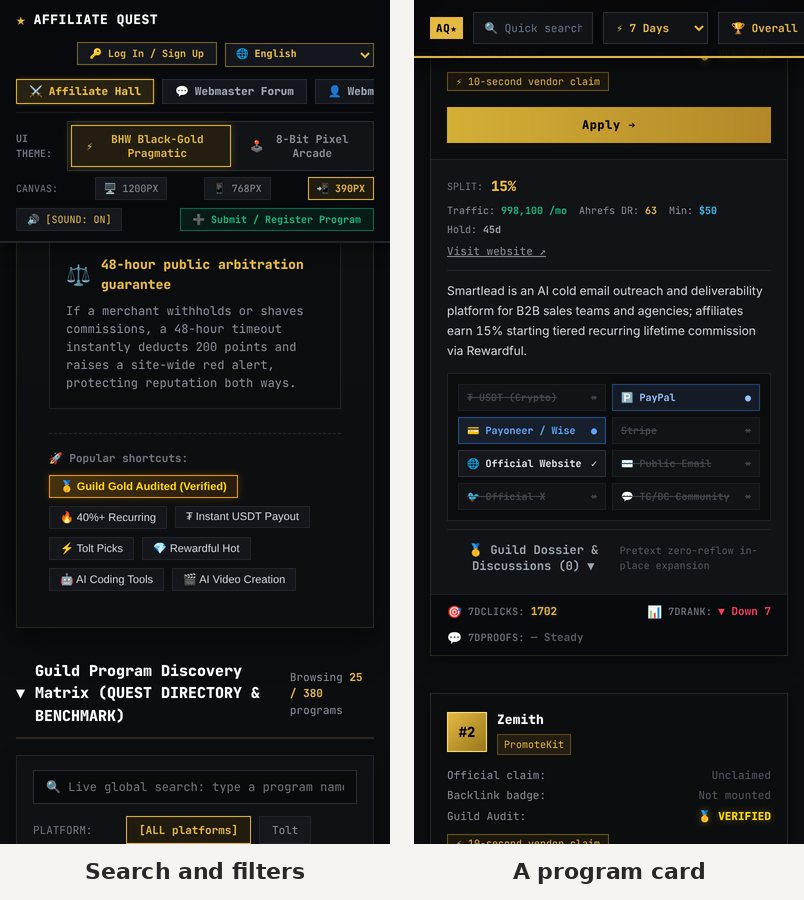
*Auf dem Handy: Suche und Filter sowie eine Programmkarte.*

## So funktioniert es

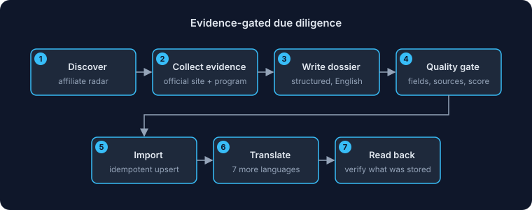
*Jeder Eintrag durchläuft eine Beleg-Schranke, bevor er importiert und übersetzt wird.*

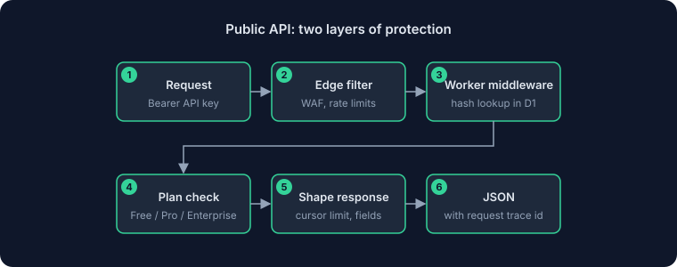
*Die öffentliche API wird zuerst am Edge geschützt, dann im Worker per Schlüssel- und Tarifprüfung.*

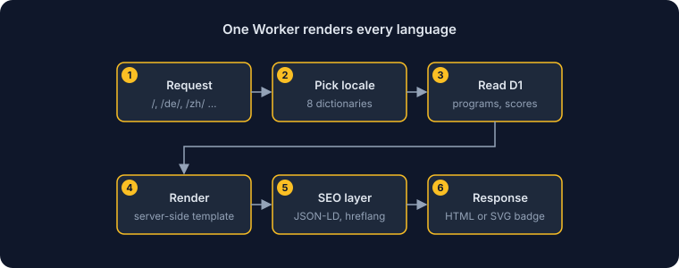
*Ein Worker rendert alle Sprachen.*

<!--notes-->
## Technische Notizen

- **Edge-nativ aus Überzeugung, nicht aus Mode.** Es gibt keinen VPS, keine Container und keine dauerhaft laufenden Prozesse. Die Begründung steht als Architekturentscheidung dokumentiert: kein Kaltstart, globale Skalierung und nahezu null Leerlaufkosten.
- **Zwei Schutzschichten für die API.** Regeln am Edge stoppen zuerst Scans und Fluten; der Worker prüft dann den gehashten Schlüssel, wendet das Kontingent des Tarifs an und liefert nur die Felder, die dieser Tarif sehen darf. Listen nutzen Cursor-Paginierung, nie tiefes `OFFSET`.
- **Betrieb hinter Zero Trust.** Admin-Bereich und Automatisierung liegen hinter Cloudflare Access mit Service-Tokens, unbefugter Verkehr wird am Edge abgewiesen, bevor er den Worker erreicht.
- **Selbstheilende Reputation.** Streitfrist-Ablauf wird beim Lesen des Werts träge ausgewertet, und der Abzug wird immer aus den aktuellen Streitfällen neu berechnet. Ein Programm, das Streitfälle ignoriert, wird automatisch geschlossen und öffnet wieder, sobald sie gelöst sind.
- **Eine harte Regel aus einem Vorfall.** Ein Massenimport nutzte einmal einen Lösch-und-neu-Einfügen-Schreibzugriff und löschte unbemerkt verknüpfte Daten. Jetzt aktualisieren Importe Zeilen an Ort und Stelle und werden vorher mit dem Schema abgeglichen. Nachbetrachtung und Regel stehen neben dem Code.
- **Alles ist dokumentiert.** Architekturentscheidungen, Fehlerprotokolle, ein Übersetzungsleitfaden und eine Datenqualitäts-Richtlinie liegen im Repository, damit die nächste Änderung von den Gründen ausgeht statt von Vermutungen.

<!--author-->
## Über den Autor

**姜芊泽 (Jiang Qianze)** ist ein Pseudonym. Ich bin unabhängiger Entwickler und baue Werkzeuge, Daten und Automatisierung für Marken, Händler und Creator, die ins Ausland expandieren. Jedes Projekt in diesen Vorstellungen habe ich allein entworfen, gebaut und betrieben, von der Produktidee bis zu Servern und Dokumentation.

Über diese Arbeit schreibe ich in meinem WeChat-Offizialkonto **Pin海引航** (auf Chinesisch). Scanne den Code, um ihm zu folgen, oder finde mich auf [GitHub](https://github.com/frommmmmg).

 
<!--/author-->

**Weitere Projekte:** [Tonu.app](https://github.com/frommmmmg/Tonu.app-showcase) · [AutoPin-CS](https://github.com/frommmmmg/AutoPin-CS-showcase) · [AffiliateScraper](https://github.com/frommmmmg/AffiliateScraper-showcase)

---

Screenshots verwenden nur Beispiel- oder öffentliche Daten. © Alle Rechte vorbehalten. Beschreibungen dürfen mit Quellenangabe zitiert werden; die Software selbst darf nicht weitergegeben werden.

