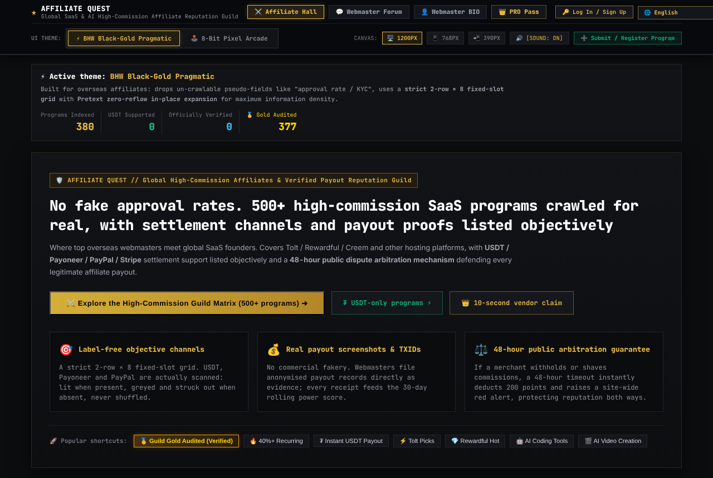
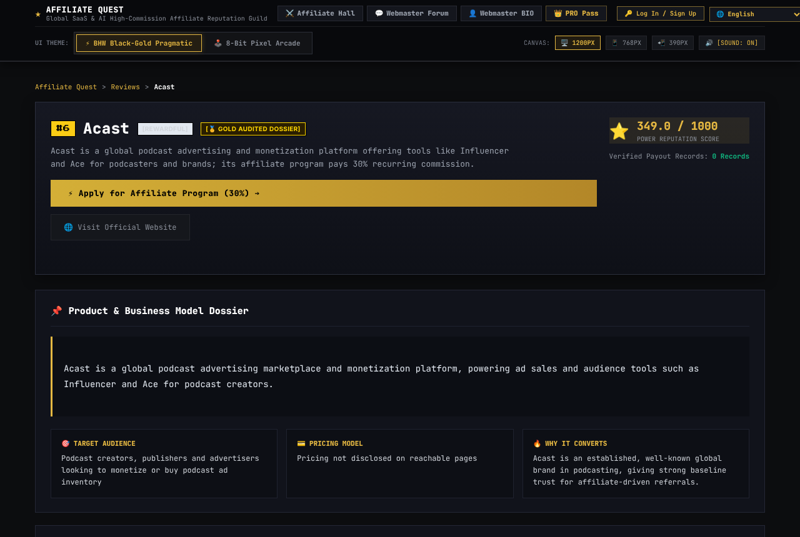

# AffProof

[English](README.md) · [中文](README.zh.md) · Español · [Deutsch](README.de.md) · [Français](README.fr.md)

> **Este repositorio es un escaparate, no una publicación de código.** AffProof es un proyecto privado, así que aquí no hay código: solo qué hace, cómo está construido y qué aspecto tiene. Si quieres hablar de él, escríbeme desde mi [perfil de GitHub](https://github.com/frommmmmg).

**Un directorio público y multilingüe que investiga los programas de afiliados para saber cuáles pagan de verdad.** Cada ficha incluye un perfil de diligencia debida con pruebas, reseñas de la comunidad, comprobantes de pago y un historial de disputas.

**Puntos clave**

- **Serverless en el borde.** Todo el sitio corre en Cloudflare Workers con base de datos D1 (SQLite) y archivos estáticos servidos desde el borde. No hay ningún proceso de servidor permanente que mantener.
- **Renderizado en servidor pensado para buscadores.** Las páginas se generan dentro del Worker, con datos estructurados JSON-LD, etiquetas `hreflang` y un sitemap por idioma.
- **8 idiomas**, con un flujo de traducción que mantiene todos los idiomas alineados con el original en inglés.
- **API pública por niveles.** Las claves se guardan como hashes SHA-256 y se validan en un middleware. Los planes Free, Pro y Enterprise controlan los límites de paginación y los campos devueltos.
- **Datos con puertas de evidencia.** Las fichas pasan por una puntuación y una verificación antes de importarse, y las escrituras en la base de datos están diseñadas para no perder datos en silencio.
- **Insignias SVG dinámicas** que otros sitios pueden incrustar.
- **Decisiones documentadas.** Los registros de decisiones de arquitectura y los análisis de errores viven junto al código.

**Tecnología:** Cloudflare Workers · Hono · D1 · Workers Assets · GitHub Actions

## Capturas

*Página de inicio pública del sitio en producción*

*Una ficha de diligencia debida en el sitio en producción*

## Cómo funciona

*Cada ficha pasa una puerta de evidencia antes de importarse y traducirse.*

*La API pública se protege primero en el borde y después con comprobaciones de clave y plan en el Worker.*

---

Las capturas usan solo datos de ejemplo o públicos. © Todos los derechos reservados. Las descripciones pueden citarse con atribución; el software no se puede redistribuir.

